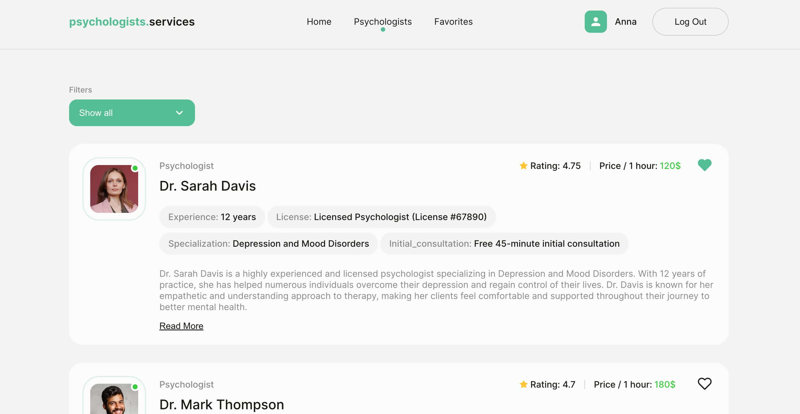

# "Psychologists.Services" - The road to the depths of the human soul

## Project Description: Psychologist Services Application

This project entails creating a web application for accessing psychologist
services. It offers users the ability to browse through a curated list of
psychologists, manage their favorites, and request appointments. The application
comprises three main pages: Home, Psychologists, and Favorites.

## Pages

1. **Home Page:** displays the company's title, slogan, a prominent link to
   begin using the application, and the option to log in or register.
2. **Psychologists Page:** users can browse psychologists sorted by criteria
   like alphabetical order, price, and popularity. Cards display essential
   details about each psychologist, with the option to load more for further
   exploration and making an appointment.
3. **Favorites Page:** authenticated users have access to a private page where
   they can manage psychologists marked as favorites, mirroring the style of the
   Psychologists page.

## Key Features:

- User Authentication: Firebase handles registration, login, and logout
  securely, with Formik & Yup used for form validation.
- Psychologist Data Management: Psychologist details are stored in a Firebase
  Realtime Database, including name, avatar, experience, reviews, price, rating,
  license, specialization, and description.
- Favorite Psychologists: Authenticated users can mark psychologists as
  favorites, with the application storing this information in localStorage.
- Detailed Profiles: Users can view detailed psychologist profiles, including
  client feedback, by clicking on a "Read more" button.
- Appointment Booking: Appointment requests can be made through a form accessed
  via a "Make an appointment" button, ensuring all required fields are filled
  out.

## Technologies used in the project

`JavaScript` `React` `React Router` `ReduxToolkit` `ReduxPersist` `Firebase`
`HTML/CSS` `Formik & Yup` `React Toastify`

## Demo

You can access the live demo of the application
[here](https://annmatsarska.github.io/psychologists-services/)

## Contributors

- [Anna Matsarska](https://github.com/AnnMatsarska)
